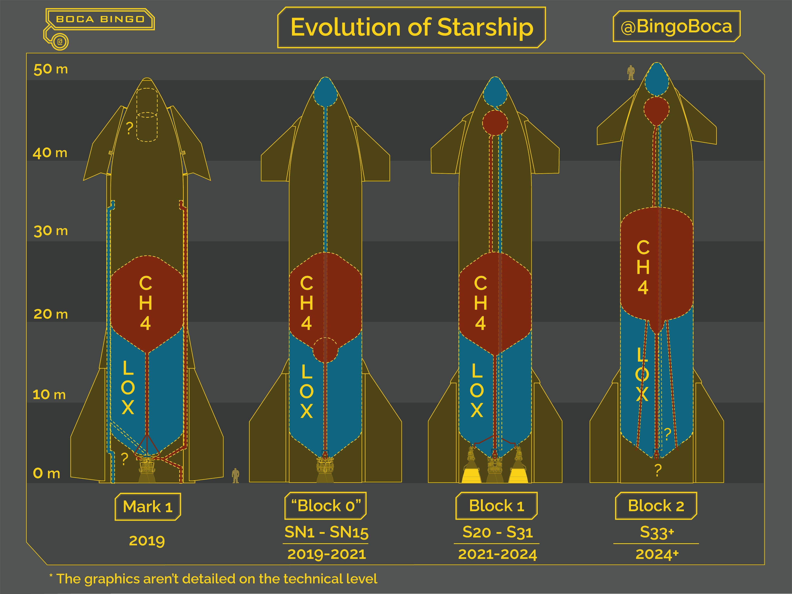
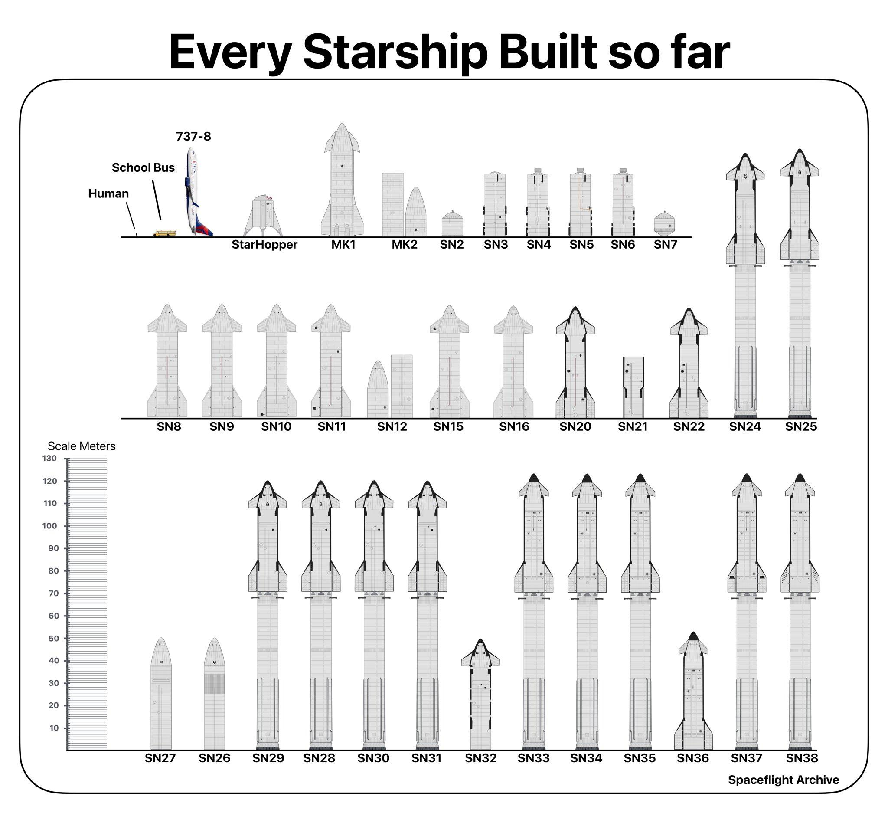

* toc
{:toc}

# SpaceX（续）

奥伯特效应（Oberth Effect）：火箭在速度越快的时候点火推进，获得的动能增量越大。探测器先借助行星引力加速（引力弹弓），在速度最高点附近点火，最大化利用燃料。旅行者号、新视野号等任务都利用了这一原理。

传统卫星使用氙气霍尔电推，星链是第一个使用氪气电推，现在v2mini上使用的是全球首创的氩气霍尔电推。

氩气在空气体积占比0.934%，是空气第三大组分，含量碾压所有其他稀有气体。

K39聚变路线：

$$
\begin{align*}
\ce{^{12}C + ^{12}C} &\to \ce{^{24}Mg + \gamma} \\
\ce{^{24}Mg + ^{4}He} &\to \ce{^{28}Si + \gamma} \\
\ce{^{28}Si + ^{4}He} &\to \ce{^{32}S + \gamma} \\
\ce{^{32}S + ^{4}He} &\to \ce{^{36}Ar + \gamma} \\
\ce{^{36}Ar + n} &\to \ce{^{37}Ar + \gamma} \\
\ce{^{37}Ar} &\to \ce{^{37}Cl + e^- + \bar{\nu}_e} \\
\ce{^{37}Cl + n} &\to \ce{^{38}Cl + \gamma} \\
\ce{^{38}Cl} &\to \ce{^{38}Ar + e^- + \bar{\nu}_e} \\
\ce{^{38}Ar + n} &\to \ce{^{39}Ar + \gamma} \\
\ce{^{39}Ar} &\to \mathbf{\ce{^{39}K + e^- + \bar{\nu}_e}}
\end{align*}
$$

K40聚变路线：

$$
\begin{align*}
\ce{^{12}C + ^{12}C &-> ^{20}Ne + ^{4}He} \\
\ce{^{20}Ne + ^{4}He &-> ^{24}Mg} \\
\ce{^{24}Mg + ^{4}He &-> ^{28}Si} \\
\ce{^{28}Si + ^{4}He &-> ^{32}S} \\
\ce{^{32}S + ^{4}He &-> ^{36}Ar} \\
\ce{^{36}Ar + ^{4}He &-> ^{40}Ca} \\
\ce{^{40}Ca + n &-> ^{40}K + ^{1}H}
\end{align*}
$$

Ar40主要K40衰变得到。

https://mp.weixin.qq.com/s/sPTRKfuhEc0xx7GacomxkA

霍尔效应推进器

https://www.zhihu.com/question/425823778

重力多大的星球无法发射化学火箭？

# Starship

整个火箭及其二级名为星舰（Starship），其助推器的名称为超重（Super Heavy）。

星舰这个运力的火箭，能够把单次发射成本压低到5000万美元，意味着只需要200美元一千克。

一个人55千克，加上额外45千克的毛重的话，进入太空的成本只要2万美元！

| 项目 | Starship V1 | Starship V2 |
| - | - | - |
| **火箭长度** | 121.3 米 | 约 123.1～124 米（增加约 3 米） |
| **近地轨道运力（可重复使用）** | 约 100 吨（理论值，不回收） | 100～125 吨 |
| **发动机** | 猛禽 V1 或 V2 发动机 | 升级为 **猛禽 V3**，推力更高、结构更简化 |
| **推进剂容量** | 较小 | 一级 3650 吨、二级 1500 吨，**总容量显著增加** |
| **干重** | 较低 | Super Heavy 增加 8 吨至 319 吨，Starship 增加 8 吨至 126 吨 |
| **结构设计** | 鼻锥前襟翼较大，有效载荷舱较长  | 襟翼变小并后移，舱段缩短以容纳更多推进剂 |
| **重复使用能力** | 部分可重复使用 | **完全可重复使用**，助推器和飞船均可回收 |
| **回收方式** | 助推器着陆腿回收 | 改为“筷子”机械臂捕获，减少结构复杂度 |
| **热防护系统** | 陶瓷防热瓦 | 增加烧蚀层，提升再入热防护能力 |

---

假设一枚火箭长径比不变，重量增加至原来的8倍，但火箭底部的面积只会增长至原来的4倍。火箭的发动机全部安装在底部，这就导致总推力增加至8倍，但推力盘的面积只有4倍。所以发动机的推力/面积比必须提高1倍。

做小型/中大型火箭，不必太在意推力/面积比，但是如果做重型和超重型火箭，发动机推力/面积比就是极为重要的指标。

而星舰需要在9米直径下实现土星五号两倍的推力，将来可能增加至3倍。

---

https://sat.huijiwiki.com/wiki/%E6%98%9F%E8%88%B0

星舰Wiki

https://mp.weixin.qq.com/s/0zAIoiflCgwC2jMEdnJ6WQ

马斯克的星际飞船，爆炸了

https://mp.weixin.qq.com/s/odjANeqbHuZAX4t_OhFwjw

终于不再爆炸了！马斯克的星舰原型SN15挑战10千米高度，稳稳着陆

https://mp.weixin.qq.com/s/Bvk-jZ4tbi3jXfDkYwiMlQ

首次成功着陆：SpaceX星舰试飞实现突破

https://www.zhihu.com/question/595930014

SpaceX“星舰”发射计划因压力阀问题而推迟，“星舰”发射面临哪些技术困难？需要突破哪些技术障碍？

---

Starship V1：

https://www.zhihu.com/question/596821956

SpaceX星舰发射失败，是什么原因？还有哪些信息值得关注？（2023.4.20）

https://www.zhihu.com/question/629931897

SpaceX星舰第二次试飞，发射及分离成功后失联，哪些信息值得关注？（2023.11.8）

https://www.zhihu.com/question/648580491

SpaceX星舰第三次试飞，达到环绕速度，重返大气层过程中失去信号，任务提前结束，有哪些看点？（2024.3.14）

https://www.zhihu.com/question/657852759

星舰第四次试飞取得成功，本体在印度洋溅落，本次试飞有哪些突破？（2024.6.6）

https://www.zhihu.com/question/859153715

如何评价SpaceX星舰第5次试飞，筷子塔成功捕获？（2024.10.13）

https://www.zhihu.com/question/4560989954

SpaceX星舰第六次试飞在海上溅落，超重型助推器完成软溅落后解体，有哪些亮点值得关注？（2024.11.19）

---

Starship V2：

https://www.zhihu.com/question/9647463595

SpaceX星舰第七次试飞二级失联后解体，一级再度上演“筷子夹火箭”回收，还有哪些信息值得关注？（2025.1.17）

https://www.zhihu.com/question/14266786234

星舰第八次试飞，升空后不久第二级飞船失联（2025.3.6）

https://www.zhihu.com/question/1905995237165335220

SpaceX星舰第九次试飞失败，意味着什么？（2025.5.28）

https://www.zhihu.com/question/1943956854041481984

如何评价星舰第十次发射取得圆满成功，达到所有预期目标？（2025.8.27）

https://www.zhihu.com/question/1960739832159508279

美国SpaceX星舰完成第十一次试飞，此次试飞有哪些亮点？（2025.10.14）

---

Starship V3：

https://www.zhihu.com/question/2041418597344469916

如何评价星舰12飞，有什么震撼的时刻？（2026.5.23）

# StarLink

---

制造业上有一个“白痴指数”，其是指某个制成品的成本比其基本材料的成本高多少。如果⼀个产品的“白痴指数”很高，那么⼀定可以通过规划设计出更有效的制造技术来大幅降低它的成本。2002年，马斯克算过火箭的“白痴指数”居然有50，也就是说成品成本比材料成本高50倍，所以他当时就让自己的工程师做开发替代。有一次一个零件供应商报价12万美元，然后马斯克喊工程师以每个5000美元的成本就做出来了。

2000年3月18日，铱星正式宣布破产，留下了一段悲壮的传奇故事。而同时期创建的其他两大LEO通信星座Globalstar（全球星）和Orbcomm（轨道通信）也宣布破产。

https://zhuanlan.zhihu.com/p/666038056

我对于卫星通信行业的一些看法

---

SpaceX的Starlink卫星是大规模量产卫星的代表，因为沿用了特斯拉的GIGA工厂的思维建造产线，每颗制造成本低于25万美元，如果计算上猎鹰九号的发射成本，平摊到每颗卫星上成本也不超过65万美元，而一枚反卫星导弹的成本大约1000-2000万美元左右，所以俄罗斯反卫星实验不可能针对Starlink卫星。

大家知道当60颗Starlink卫星准备发射前夕完成堆叠后发现其中几颗有问题会如何？答案是继续发射，因为成本极低并且马斯克的Starlink不是直送低轨，先送到一定高度由每颗Starlink卫星自己的霍尔推进器工作爬到指定的工作高度，因此质量有问题的Starlink卫星释放后不会爬升，而是快速进入大气层自毁不会成为太空垃圾。

星链星座现在有一组卫星（大概200多颗）跑在一条近地点不到270km的超低轨道上。这么低的轨道在以前是几乎不可用的，因为很难维持住，会迅速被大气阻力拖下去，只有一些军用间谍卫星，会选择短时间在这个轨道上运行。但是星链卫星现在有了高性能的氪离子推进器，它就可以稳定地维持住这么低的轨道。

https://www.zhihu.com/question/558699932

俄媒表示，俄军方宣布针对外国卫星展开反卫星武器试验，有哪些信息值得关注？

---

由于星链卫星位于340千米～1300千米之间的地球低轨道上，这就要求反卫星导弹的最大飞行高度可达1300千米。

要知道如今防空导弹的飞行高度才几十千米，可是差得太远了，这就需要研发专用的反卫星导弹。

目前来看，反卫星导弹主要有“美国的海基标准-3，空基ASM-135”，“俄罗斯的陆基努多尔”。

由于反卫星导弹的价格昂贵，比如标准-3反导拦截弹的价格就高达2000万美元一枚。而星链中的一颗卫星的价格仅不到50万美元，要用反卫星导弹将所有的星链卫星都摧毁，那代价实在是太高了，就连美国都难以承受。

美俄两国都有激光武器，俄罗斯的主要就是“佩列斯韦特”战略激光反卫星武器。不过，各国现役的激光武器都无法对太空中的卫星造成有效的伤害。主要就是其功率不够大，导致射程有限，基本上也就几千米的距离，根本无力杀伤数百千米高空中的卫星。

https://k.sina.com.cn/article_5501440086_147e9505600101icab.html

怎么样才能破除美国的星链威胁？

---

Starlink用户终端，最高发射功率为2.44瓦。

2020年FCC发出的报告，光美国就有1830万人口没有宽带网络覆盖。

Starlink第二代系统将使用Ku、Ka和E频段频谱。

https://finance.sina.com.cn/tech/2021-06-13/doc-ikqciyzi9362614.shtml

SpaceX申请运营第二代Starlink终端 天线输出功率减半

https://zhuanlan.zhihu.com/p/669146560

​星链终端所用芯片梳理及商业机遇

https://zhuanlan.zhihu.com/p/691577460

基于2023年卫星通信行业运营情况浅谈一下Starlink竞争优势

---

星链的时间源头是地面站原子钟；卫星本身不产生标准时间，只做“带晶振的移动时间信标”，靠地面+激光星间链路把全网时间锁到同一套地面原子钟时标上，再把时标、星历、帧时钟转发给用户。

---

https://zhuanlan.zhihu.com/p/272628707

超美国95%宽带！Starlink实测网速突破160Mbps

https://www.zhihu.com/question/508552825

如何看待美SpaceX星链卫星两次接近中国空间站，我方为确保在轨航天员安全实施紧急避碰？
